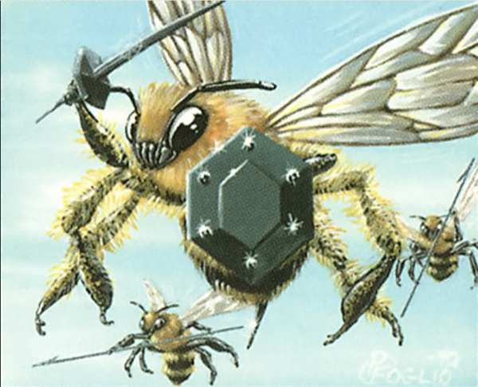

# Colmena

[](https://github.com/4rth4S/colmena/actions/workflows/ci.yml)
[](./LICENSE)
[](./Cargo.toml)
[](https://crates.io/crates/colmena)

<p align="center">
  
</p>

<p align="center"><strong>Gobernanza determinista para Claude Code multi-agente.</strong></p>

<p align="center">Reglas YAML + firewall en Rust + audit.log para cada llamada a herramientas. Misiones multi-agente con revisión de auditor. Confianza calibrada por ELO según el rol.</p>

---

## 🎯 ¿Cuál se adapta a ti?

| Tú eres... | Colmena te ofrece |
|---|---|
| **Pentester** 🛡️ | Agentes nativos de Caido con alcance definido, Bash restringido, almacenamiento de hallazgos, rastro de auditoría reproducible. [Comienza aquí →](https://docs.colmena.space/use-cases/pentest/) |
| **Desarrollador** 💻 | Auto-aprobación de `cargo test` y `git log`, solicitud de permiso en `git push`, bloqueo de `--force`. Revisor de solo lectura. [Comienza aquí →](https://docs.colmena.space/use-cases/code-review/) |
| **DevOps / SRE** ⚙️ | Patrones de Bash para `kubectl`, `terraform`, `helm` pre-configurados. Secretos bloqueados. Delegaciones por sesión. [Comienza aquí →](https://docs.colmena.space/use-cases/incident-response/) |

Si ejecutas agentes de IA y te importa la auditabilidad, Colmena te proporciona un rastro determinista y rendición de cuentas por rol a lo largo del tiempo.

## 🚀 Instalación rápida

```bash
# Desde crates.io
cargo install colmena
colmena setup
colmena doctor

# Desde el código fuente
git clone https://github.com/4rth4S/colmena
cd colmena && cargo build --workspace --release
./target/release/colmena setup && ./target/release/colmena doctor
```

Dos comandos después de la instalación. El firewall estará activo para cada sesión de Claude Code.

[Guía de instalación completa →](https://docs.colmena.space/quickstart/getting-started/) · [Deja que Claude configure Colmena →](https://docs.colmena.space/quickstart/install-mode-b/)

## 🧠 Qué hace Colmena

Colmena se sitúa entre Claude Code y tu sistema de archivos. Cada llamada a una herramienta — Bash, Write, WebFetch — pasa a través de un **firewall determinista** en <15ms. Cero llamadas a LLM, cero costo por llamada, cero dependencias de la nube. Solo reglas YAML compiladas a regex, evaluadas en una cadena de precedencia fija con un rastro de auditoría a prueba de manipulaciones.

**Los tres pilares:**

- 🔒 **Autonomía delimitada.** Los agentes son libres dentro de su dominio y son bloqueados en el límite. La política es código: reglas que tú escribiste, no la mejor suposición de un LLM.
- ✅ **Revisión obligatoria.** Cada artefacto pasa por una evaluación del auditor. Calificación QPC (Calidad + Precisión + Exhaustividad). Sin revisión no hay avance: el hook SubagentStop lo hace cumplir.
- 📈 **Confianza ganada.** Las calificaciones ELO se calibran con el tiempo según los resultados de las revisiones. Cinco niveles. La confianza no se declara, se demuestra.

[Lee los conceptos →](https://docs.colmena.space/concepts/scoped-autonomy/) · [Explora todas las funciones →](https://docs.colmena.space/reference/cli/)

## 📚 Documentación

Toda la documentación técnica se encuentra en **[docs.colmena.space](https://docs.colmena.space)**:

| Sección | Qué encontrarás |
|---------|-----------------|
| [Quickstart](https://docs.colmena.space/quickstart/getting-started/) | Instalación, verificación, primera misión |
| [Conceptos Core](https://docs.colmena.space/concepts/scoped-autonomy/) | Firewall, misiones, ELO, autonomía delimitada |
| [Casos de Uso](https://docs.colmena.space/use-cases/pentest/) | Pentest, revisión de código, respuesta a incidentes, refactorización |
| [Referencia](https://docs.colmena.space/reference/cli/) | Comandos CLI, herramientas MCP, YAML de roles, esquema de manifiesto |
| [Arquitectura](https://docs.colmena.space/architecture/overview/) | Descripción general del sistema, pipeline de hooks, ciclo de vida de la misión |
| [Comunidad](https://docs.colmena.space/community/contributing/) | Guía de contribución, hoja de ruta, política de seguridad |

## 🏗️ Principios de diseño

- **Latencia de hook < 15ms** — Rust, regex pre-compiladas, sin llamadas de red.
- **Fallback seguro** — cualquier fallo en un hook devuelve `ask`, nunca `deny` ni un cierre inesperado (crash).
- **Archivos sobre bases de datos** — configuración YAML, cola JSON, logs JSONL, versionable mediante git.
- **Construido sobre CC, no alrededor de él** — hooks + MCP, sin trucos.
- **Agnóstico al dominio** — el motor es genérico, el dominio reside en tus plantillas.
- **La autoridad humana prevalece** — las anulaciones de YAML siempre superan al ELO; revoca todo con `colmena calibrate reset`.

## 🔒 Seguridad

Consulta [SECURITY.md](./SECURITY.md) para conocer el proceso de divulgación. Cada versión pasa por `cargo deny` y `cargo audit` en la CI.

## 📄 Licencia

Publicado bajo la [Licencia MIT](./LICENSE).

## ✨ Contribuidores

Consulta [CONTRIBUTORS.md](./CONTRIBUTORS.md).

---

<p align="center">construido con ❤️‍🔥 por AppSec</p>
